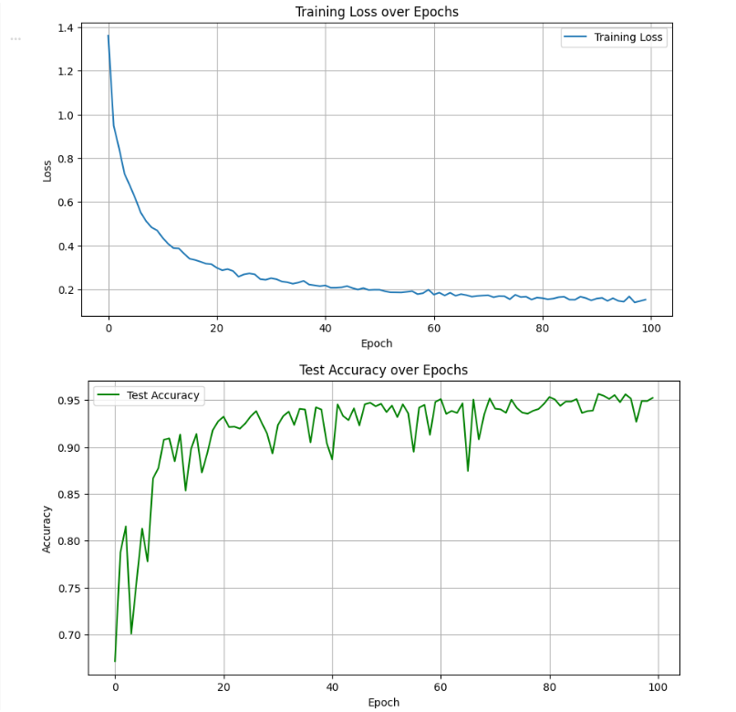
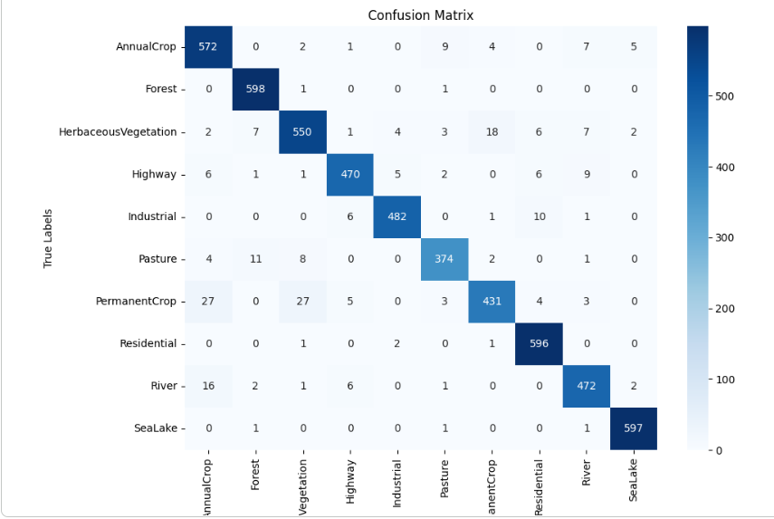
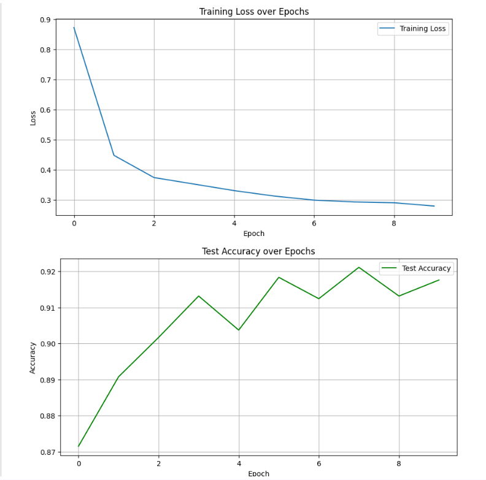
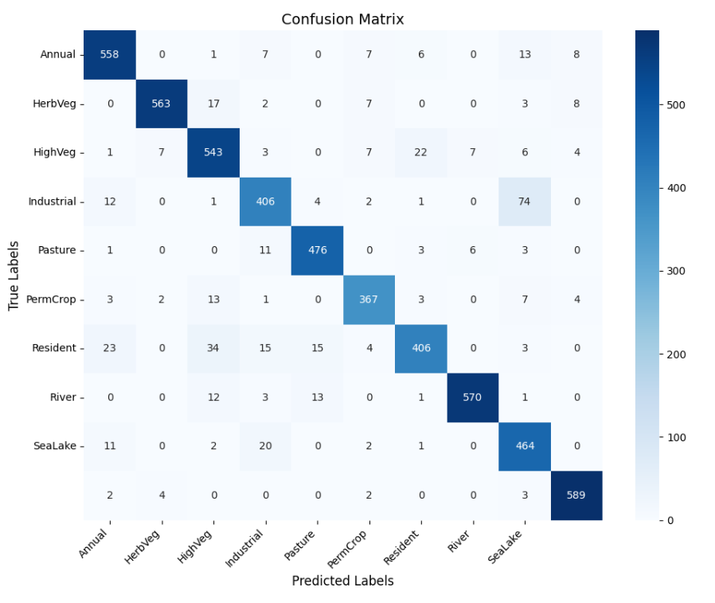
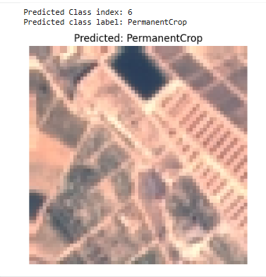
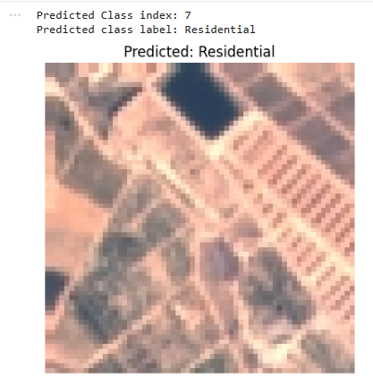

# LandVisionNet — EuroSAT Satellite Land Classification (CNN vs VGG16 in PyTorch)

LandVisionNet is a deep learning project that classifies satellite land use & land cover images from the EuroSAT dataset. Two models were developed and compared using PyTorch: a custom Convolutional Neural Network (CNN) and a transfer learning model based on VGG16. The task involves multi-class classification across 10 land cover categories.

---

##  Dataset — EuroSAT (RGB, 10 Classes)

The EuroSAT dataset consists of RGB satellite imagery representing 10 land cover classes such as Residential, Forest, River, Highway, and Pasture.

- **Classes:** 10
- **Image modality:** RGB
- **Task:** Multi-class classification
- **Loading:** Downloaded & extracted manually; loaded via custom `Dataset` + `DataLoader` in PyTorch

> The dataset was preprocessed with label encoding, train-test splits, and standard normalization/transforms.

---

##  Models Trained

Two architectures were implemented and compared:

### **1. Custom CNN (from scratch)**  
- Designed for 64×64 RGB imagery
- Trained end-to-end on EuroSAT
- Strong generalization despite smaller footprint

### **2. VGG16 (Transfer Learning)**
- Pretrained on ImageNet
- Feature extractor layers frozen
- Classifier block replaced for EuroSAT classes

---

##  Results — Performance Comparison

| Model  | Train Accuracy | Test Accuracy |
|--------|----------------|---------------|
| **CNN** | 97.61%         | **95.22%**     |
| **VGG16** | 93.12%         | 91.50%         |

Both models performed well, with the custom CNN outperforming the VGG16 transfer model on EuroSAT.

---

##  Training Curves & Metrics

### **CNN Training Curve**
<p align="center">
  
</p>

### **CNN Confusion Matrix**
<p align="center">
  
</p>

### **VGG16 Training Curve**
<p align="center">
  
</p>

### **VGG16 Confusion Matrix**
<p align="center">
  
</p>

---

##  Sample Predictions

Both models were tested on unseen EuroSAT images:

**CNN Prediction**
<p align="center">
  
</p>

**VGG16 Prediction**
<p align="center">
  
</p>

---

##  Project Structure

```
LandVisionNet/
├── notebooks/
│   ├── eurosat_cnn.ipynb
│   └── eurosat_vgg16.ipynb
│
├── assets/
│   ├── cnn/
│   └── vgg16/
│
└── README.md
```

---

##  Tech Stack

- **Framework:** PyTorch
- **Models:** CNN, VGG16 (Transfer Learning)
- **Language:** Python
- **Tools:** NumPy, Pandas, Matplotlib, Scikit-learn
- **Task Type:** Multi-class classification

---

##  Key Insights & Takeaways

- **Custom CNNs can outperform ImageNet transfer learning on satellite imagery.**  
  The CNN achieved higher accuracy than VGG16 despite having fewer parameters, suggesting that EuroSAT contains domain-specific patterns that are not well captured by ImageNet pretrained features.

- **Transfer learning still provided fast convergence and stable training.**  
  VGG16 required fewer epochs and less tuning to reach strong performance, demonstrating the optimization benefits of pretrained feature extractors.

- **Satellite land-cover classification rewards texture and color-based features.**  
  Categories such as River, Forest, and Residential have distinctive spectral and spatial patterns that simpler CNNs can learn effectively without large-scale pretraining.

- **Both models generalized well with minimal overfitting.**  
  The performance gap between train and test sets was small for both architectures, indicating that EuroSAT is well-suited for supervised training without heavy regularization.

- **Remote sensing differs from natural image benchmarks.**  
  ImageNet pretraining was not optimal for this task, highlighting the importance of domain-adaptive models for remote sensing applications.


---

## 🚀 Potential Future Work

- Add inference web UI (Streamlit / FastAPI)
- Train on multispectral variant
- Export model with TorchScript or ONNX


---


